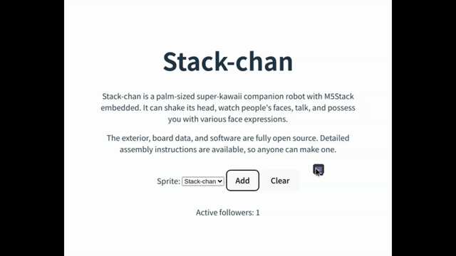

# Mouse Follower

[](https://github.com/meganetaaan/mouse-follower/actions/workflows/ci.yml) [](https://www.npmjs.com/package/@meganetaaan/mouse-follower) [](https://www.npmjs.com/package/@meganetaaan/mouse-follower) [](https://nodejs.org/) [](http://www.typescriptlang.org/) [](https://opensource.org/licenses/MIT)

A TypeScript library for creating animated sprites that smoothly follow the mouse cursor using physics-based movement.

## 🚀 [Live Demo](https://meganetaaan.github.io/mouse-follower/)

Try the interactive demo to see the library in action!



## Features

- 🎯 Smooth physics-based following animation
- 🎨 Canvas-based sprite rendering with transparency support
- 🔗 Chain multiple followers in formation
- ⚡ High-performance animation with requestAnimationFrame
- 🎮 Customizable physics parameters (velocity, acceleration)
- 📱 Works on both desktop and mobile devices

## Quick Start

### CDN (Direct Import)

```html
<script type="module">
  import { follower } from 'https://cdn.jsdelivr.net/npm/@meganetaaan/mouse-follower/dist/index.js';

  document.addEventListener("DOMContentLoaded", async () => {
    await follower().start();
  })
</script>
```

### NPM Installation

```bash
npm install @meganetaaan/mouse-follower
```

```typescript
import { follower } from '@meganetaaan/mouse-follower';

// Create a follower with default settings
const myFollower = follower();

// Start following
await myFollower.start();
```

## API Reference

### `follower(options?: FollowerOptions): Follower`

Creates a new follower instance.

#### Options

- `target` - Target to follow: `FollowTarget` object with `{x, y}` properties, `mouseTarget()`, or another `Follower`
- `bindTo` - HTML element to attach the follower to (default: `document.body`)
- `sprite` - Sprite configuration:
  - `url` - Path to sprite sheet image
  - `width` - Sprite width in pixels
  - `height` - Sprite height in pixels
  - `frames` - Number of frames in sprite sheet
  - `transparentColor` - Color to treat as transparent (default: `'rgb(0, 255, 0)'`)
  - `animation` - Animation settings with `interval` in ms
  - `animations` - Named animation configurations
- `physics` - Physics configuration:
  - `velocity` - Maximum movement speed in px/s (default: 400)
  - `accel` - Maximum acceleration in px/s² (default: 2000)
  - `braking` - Braking behavior:
    - `stopDistance` - Stop distance threshold in pixels (default: 30)
    - `distance` - Distance to start braking (default: 200)
    - `strength` - Braking strength multiplier (default: 8.0)
    - `minVelocity` - Minimum velocity before stopping (default: 50)

#### Methods

- `start()` - Start following animation
- `stop()` - Stop following animation
- `setTarget(target: FollowTarget)` - Change follow target
- `destroy()` - Remove follower and clean up
- `playAnimation(name: string)` - Play a named animation
- `pauseAnimation()` - Pause current animation
- `addEventListener(type, listener)` - Add event listener for 'start' or 'stop' events
- `removeEventListener(type, listener)` - Remove event listener

#### Properties

- `x` - Current x position
- `y` - Current y position

### Helper Functions

#### `mouseTarget(): MouseTarget`

Returns a singleton target that tracks mouse position.

#### `offsetTarget(target: FollowTarget, offsetX: number, offsetY: number): OffsetTarget`

Creates a target with an offset from another target.

## Examples

### Basic Mouse Follower

```typescript
import { follower } from '@meganetaaan/mouse-follower';

const myFollower = follower();

await myFollower.start();
```

### With Custom Sprite

```typescript
import { follower } from '@meganetaaan/mouse-follower';

// Create a follower with custom sprite
const myFollower = follower({
  sprite: {
    url: '/path/to/sprite.png',
    width: 32,
    height: 32,
    frames: 4
  }
});

await myFollower.start();
```

### Follower Chain

```typescript
import { follower, mouseTarget, offsetTarget } from '@meganetaaan/mouse-follower';

// First follower follows mouse
const leader = follower({
  target: mouseTarget(),
});

// Second follower follows the first with offset
const follower2 = follower({
  target: offsetTarget(leader, -40, 0),
});

await leader.start();
await follower2.start();
```

### Custom Animation Events

```typescript
const animatedFollower = follower({
  sprite: {
    url: './sprites/animated.png',
    width: 32,
    height: 64,
    animations: {
      walk: { start: [0, 0], numFrames: 4, repeat: true },
      action: { start: [0, 32], numFrames: 4, repeat: false }
    }
  }
});

// Play different animations based on movement
animatedFollower.addEventListener('start', (e) => {
  e.detail.follower.playAnimation('walk');
});

animatedFollower.addEventListener('stop', (e) => {
  e.detail.follower.playAnimation('action');
});

await animatedFollower.start();
```

## Development

This project uses a pnpm workspace structure with separate library and demo packages.

### Workspace Structure

```
packages/
├── mouse-follower/    # Main library (@meganetaaan/mouse-follower)
└── demo/             # Demo application (private package)
```

### Development Commands

```bash
# Install dependencies for entire workspace
pnpm install

# Start demo development server
pnpm dev

# Run library tests
pnpm test

# Build library only
pnpm build:lib

# Build both library and demo
pnpm build

# Lint and format all packages
pnpm check:fix

# Publish library to npm
pnpm publish:lib
```

### Library Development

To work on the library itself:

```bash
# Navigate to library package
cd packages/mouse-follower

# Run tests in watch mode
pnpm test

# Build library
pnpm build
```

## Browser Support

- Chrome/Edge 88+
- Firefox 78+
- Safari 14+
- Mobile browsers with touch support

## License

MIT