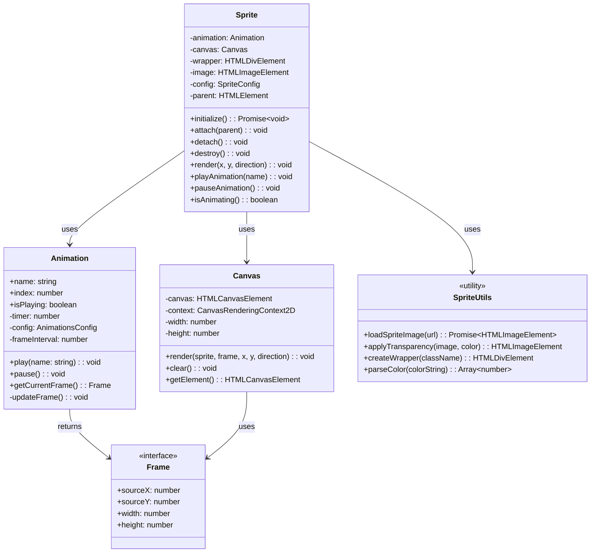
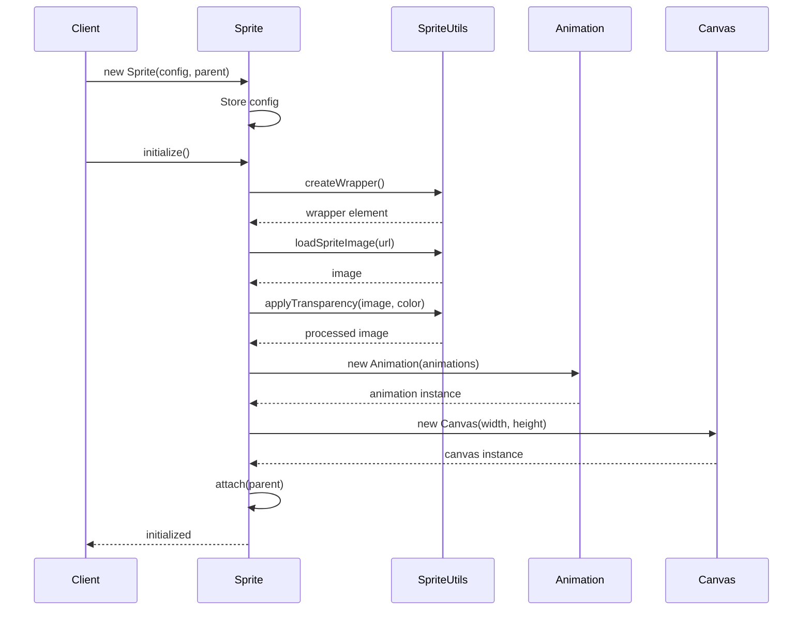
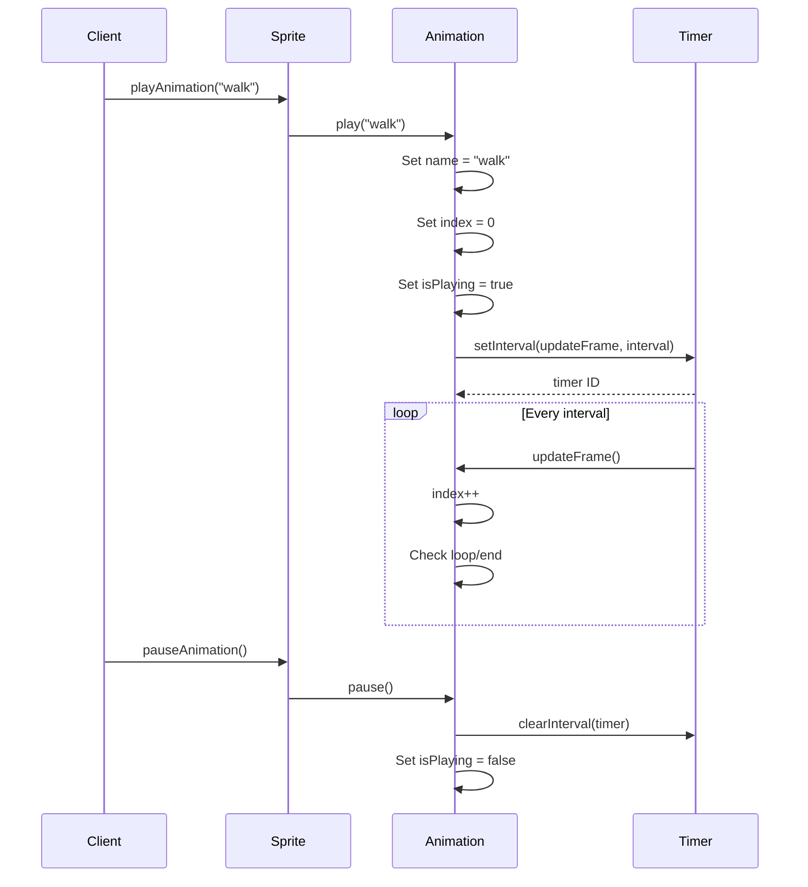
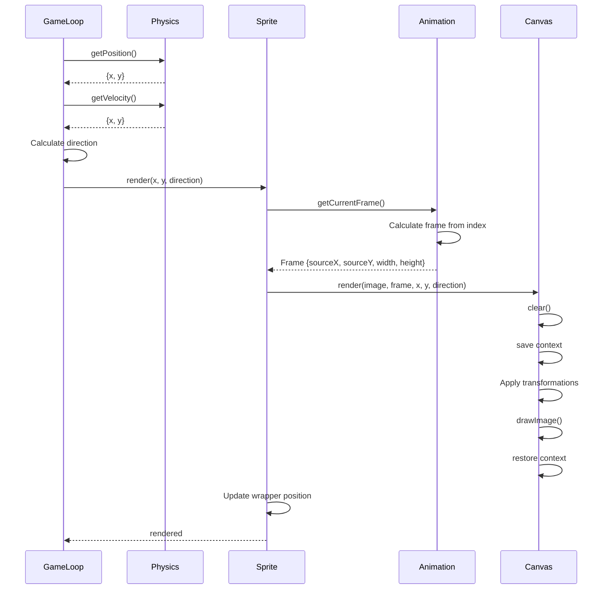

# SpriteRenderer リファクタリング設計書

## 1. 設計概要

### 現在の問題点

現在の`SpriteRenderer`クラスは以下の責務が混在しており、単一責任原則に違反しています：

- **アニメーション管理**: タイマー制御、フレーム進行、ループ管理
- **描画処理**: Canvas操作、スプライト描画、方向制御
- **DOM管理**: 要素の作成・削除、位置更新、親要素への追加
- **リソース管理**: 画像読み込み、透明度処理

この混在により、テストが困難で、個別機能の再利用や拡張が難しくなっています。

### 新設計の方針

1. **関心の分離**: 各クラスが単一の責務のみを持つ
2. **シンプルなインターフェース**: 必要最小限のメソッドとプロパティ
3. **関数型アプローチ**: 状態管理が不要な処理はユーティリティ関数化
4. **モダンJavaScript**: プライベートメンバー（#）によるカプセル化

## 2. クラス設計

### Animation クラス
アニメーションの状態管理とフレーム制御を担当

```typescript
interface Frame {
  sourceX: number;  // スプライトシート内のX座標
  sourceY: number;  // スプライトシート内のY座標
  width: number;    // フレーム幅
  height: number;   // フレーム高さ
}

class Animation {
  name: string;           // 現在のアニメーション名
  index: number;          // 現在のフレームインデックス
  #timer?: number;        // setIntervalのID
  #config: AnimationsConfig;
  #frameInterval: number;
  isPlaying: boolean;
  
  constructor(config: AnimationsConfig);
  play(name: string): void;    // アニメーション開始
  pause(): void;                // アニメーション停止
  getCurrentFrame(): Frame;     // 現在のフレーム情報取得
  #updateFrame(): void;         // フレーム進行（内部メソッド）
}
```

### Canvas クラス
純粋な描画処理のみを担当

```typescript
class Canvas {
  #canvas: HTMLCanvasElement;
  #context: CanvasRenderingContext2D;
  #width: number;
  #height: number;
  
  constructor(width: number, height: number);
  render(
    sprite: HTMLImageElement,
    frame: Frame,
    x: number,
    y: number,
    direction: "left" | "right"
  ): void;
  clear(): void;                           // キャンバスクリア
  getElement(): HTMLCanvasElement;         // Canvas要素取得
}
```

### Sprite クラス
統合インターフェースとDOM管理を担当

```typescript
class Sprite {
  #animation: Animation;
  #canvas: Canvas;
  #wrapper: HTMLDivElement;
  #image: HTMLImageElement;
  #config: SpriteConfig;
  #parent?: HTMLElement;
  
  constructor(config: SpriteConfig, parent?: HTMLElement);
  
  // 初期化
  async initialize(): Promise<void>;
  
  // DOM管理
  attach(parent: HTMLElement): void;
  detach(): void;
  destroy(): void;
  
  // レンダリング
  render(x: number, y: number, direction: "left" | "right"): void;
  
  // アニメーション制御
  playAnimation(name: string): void;
  pauseAnimation(): void;
  isAnimating(): boolean;
}
```

### ユーティリティ関数
状態管理が不要な処理を関数として提供

```typescript
// 画像読み込み
export async function loadSpriteImage(url: string): Promise<HTMLImageElement>;

// 透明度処理
export function applyTransparency(
  image: HTMLImageElement,
  color: string
): HTMLImageElement;

// DOM要素作成
export function createWrapper(className: string): HTMLDivElement;

// 色パース
export function parseColor(colorString: string): [number, number, number];
```

## 3. サンプル実装例

### スプライトの初期化

```typescript
// 独自スプライトの設定
const config: SpriteConfig = {
  url: "assets/custom-character.png",
  width: 64,
  height: 64,
  transparentColor: "rgb(255, 0, 255)", // マゼンタを透明に
  animations: {
    idle: {
      start: [0, 0],
      numFrames: 1,
      repeat: false,
      interval: 0
    },
    walk: {
      start: [0, 0],
      numFrames: 8,
      repeat: true,
      interval: 100
    },
    run: {
      start: [0, 64],
      numFrames: 8,
      repeat: true,
      interval: 50
    },
    jump: {
      start: [0, 128],
      numFrames: 4,
      repeat: false,
      interval: 75
    }
  }
};

// スプライトの作成と初期化
const sprite = new Sprite(config, document.body);
await sprite.initialize();
```

### アニメーションの開始と終了

```typescript
// 歩行アニメーション開始
sprite.playAnimation("walk");

// 走行アニメーションに切り替え
sprite.playAnimation("run");

// アニメーション一時停止
sprite.pauseAnimation();

// ジャンプアニメーション（非ループ）
sprite.playAnimation("jump");

// アニメーション状態確認
if (sprite.isAnimating()) {
  console.log("Animation is playing");
}
```

### DOM要素へのバインド

```typescript
// 初期化時にバインド
const sprite1 = new Sprite(config, document.getElementById("container"));

// 後からバインド
const sprite2 = new Sprite(config);
await sprite2.initialize();
sprite2.attach(document.getElementById("game-area"));

// 一時的にDOMから削除
sprite2.detach();

// 再度追加
sprite2.attach(document.getElementById("other-area"));

// 完全に破棄
sprite2.destroy();
```

### レンダリング統合例

```typescript
// Physicsと組み合わせた使用例
function gameLoop() {
  // 物理演算から位置と向きを取得
  const position = physics.getPosition();
  const velocity = physics.getVelocity();
  const direction = velocity.x < 0 ? "left" : "right";
  
  // スプライトをレンダリング
  sprite.render(position.x, position.y, direction);
  
  // 速度に応じてアニメーション切り替え
  const speed = Math.sqrt(velocity.x ** 2 + velocity.y ** 2);
  if (speed > 200) {
    sprite.playAnimation("run");
  } else if (speed > 50) {
    sprite.playAnimation("walk");
  } else {
    sprite.playAnimation("idle");
  }
  
  requestAnimationFrame(gameLoop);
}
```

## 4. クラス図



## 5. シーケンス図

### スプライト初期化シーケンス



### アニメーション再生シーケンス



### フレーム更新・レンダリングシーケンス



## 6. 実装の移行計画

### フェーズ1: 新クラスの実装
1. `Animation`クラスの実装
2. `Canvas`クラスの実装
3. ユーティリティ関数の実装
4. 単体テストの作成

### フェーズ2: 統合とテスト
1. `Sprite`クラスの実装（新クラスを統合）
2. 既存の`SpriteRenderer`との互換性確認
3. 統合テストの実装

### フェーズ3: 移行
1. `follower.ts`を新しい`Sprite`クラスを使用するよう更新
2. 既存の`SpriteRenderer`を非推奨化
3. ドキュメントの更新

## 7. メリットと期待される効果

### メリット
- **テスタビリティ向上**: 各クラスが独立してテスト可能
- **再利用性**: Animation、Canvasクラスは他のプロジェクトでも使用可能
- **保守性**: 責務が明確で、変更の影響範囲が限定的
- **パフォーマンス**: 不要な状態管理を削減

### 期待される効果
- バグの減少（責務が明確になることで）
- 新機能追加の容易化（拡張ポイントが明確）
- コードレビューの効率化（各クラスの役割が明確）
- 新規開発者の学習コスト低減（シンプルなインターフェース）